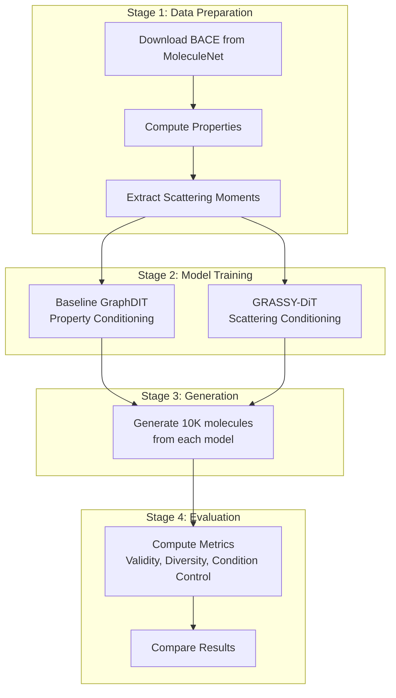

# GRASSY-DiT vs GraphDIT Comparison on BACE

## Overview

Compare GRASSY-DiT (scattering conditioning) vs baseline GraphDIT (property conditioning) on the BACE dataset (1,513 beta-secretase inhibitors), replicating the GraphDIT paper's experimental setup for a fair comparison.

## Pipeline Architecture



## Files to Create

| File | Purpose |

|------|---------|

| [`datasets/prepare_bace.py`](datasets/prepare_bace.py) | Download and prepare BACE dataset |

| [`evaluation/__init__.py`](evaluation/__init__.py) | Evaluation module |

| [`evaluation/train_baseline_graphdit.py`](evaluation/train_baseline_graphdit.py) | Train property-conditioned GraphDIT |

| [`evaluation/generate_comparison.py`](evaluation/generate_comparison.py) | Generate molecules from both models |

| [`evaluation/evaluate_comparison.py`](evaluation/evaluate_comparison.py) | Compute and compare all metrics |

| [`evaluation/run_full_comparison.py`](evaluation/run_full_comparison.py) | Master script to run entire pipeline |

## Stage Details

### Stage 1: Data Preparation

**`datasets/prepare_bace.py`**

- Download BACE from MoleculeNet/DeepChem
- Compute: QED, MolWt, LogP, TPSA, HBA, HBD, SA score, Synth scores (SAS, SCS)
- Include BACE activity label (categorical: inhibitor 1 / non-inhibitor 0)
- Split 6:2:2 (907 train / 303 val / 303 test)
- Output: `datasets/BACE.npy`, `datasets/BACE_stats.npy`

**Extract scattering** (existing script):

```bash
python grassy_dit/extract_scattering_fixed.py --dataset datasets/BACE.npy --output grassy_dit/data_bace/
```

### Stage 2: Model Training

**Baseline GraphDIT** - conditions on properties directly:

- Numerical: Synth scores (SAS, SCS)
- Categorical: BACE activity (0/1)
- Architecture: hidden_size=384, num_layer=12 (match GRASSY-DiT)

**GRASSY-DiT** - conditions on scattering moments:

- 704-dim scattering vector
- Same architecture for fair comparison

### Stage 3: Generation

For each test molecule's conditions, generate samples:

- 10,000 total molecules per model (matching paper)
- Baseline: condition on (synth_score, bace_activity)
- GRASSY-DiT: condition on scattering_moments

### Stage 4: Evaluation Metrics

From GraphDIT paper Table 2:

| Metric | Type | Description |

|--------|------|-------------|

| Validity | Basic | Fraction of valid SMILES |

| Coverage | Distribution | Heavy atom type coverage |

| Diversity | Distribution | Internal Tanimoto diversity |

| Similarity | Distribution | Fragment similarity to reference |

| Distance | Distribution | Frechet ChemNet Distance |

| Synth MAE | Condition | Error on synthesizability score |

| Property Acc | Condition | Accuracy on BACE activity |

Plus MOSES metrics: FCD, SNN, Novelty, Filters

## Expected Outputs

- `checkpoints/baseline_graphdit_bace.pt` - Trained baseline
- `checkpoints/grassy_dit_bace.pt` - Trained GRASSY-DiT
- `results/comparison_metrics.csv` - Side-by-side metrics
- `results/comparison_plots/` - Visualization of results